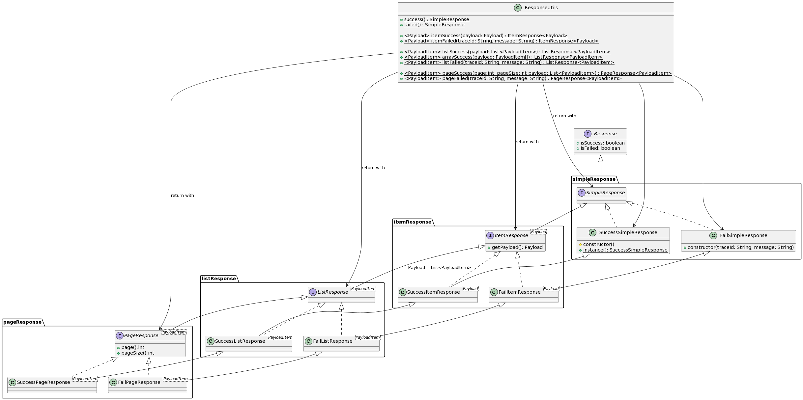

## Dependency
maven
```xml
    <dependency>
        <groupId>dev.xethh.webtools</groupId>
        <artifactId>RNRUtils</artifactId>
        <version>0.0.1</version>
    </dependency>
```

## Demo

### Request creation

```java
package dev.xethh.webtools;

import dev.xethh.webtools.dto.base.request.PaginatedRequest;
import dev.xethh.webtools.dto.base.request.Request;

public class RequestCreationDemo {
    /**
     * Simple Request, just extends {@link Request}
     */
    public static class SomeRequest extends Request {
        private String fieldA;

        public String getFieldA() {
            return fieldA;
        }

        public void setFieldA(String fieldA) {
            this.fieldA = fieldA;
        }
    }

    /**
     * Paginated Request, just extends {@link PaginatedRequest}
     */
    public static class SomePaginatedRequest extends PaginatedRequest {
        private String fieldB;

        public String getFieldB() {
            return fieldB;
        }

        public void setFieldB(String fieldB) {
            this.fieldB = fieldB;
        }
    }

    public static void main(String[] args) {
    }
}
```

### Paginated Request

```java
package dev.xethh.webtools;

import dev.xethh.webtools.dto.base.request.PaginatedRequest;

public class DemoSorting {
    public static void main(String[] args) {
        var request = new PaginatedRequest();
        request.setSorting("+b,c,-d");
        // Optional.empty
        System.out.println(request.asSortingOpt());

        request.setSorting(",-b,c,-d");
        //Optional[
        //  Sorting{
        //    items=[
        //      SortItem{field='b', direction=Desc}, 
        //      SortItem{field='c', direction=Asc}, 
        //      SortItem{field='d', direction=Desc}
        //    ]
        //  }
        //]
        System.out.println(request.asSortingOpt());

        request.setSorting("a,-b,c,-d");
        // Optional[
        //  Sorting{
        //    items=[
        //        SortItem{field='a', direction=Asc},
        //        SortItem{field='b', direction=Desc},
        //        SortItem{field='c', direction=Asc},
        //        SortItem{field='d', direction=Desc}
        //    ]
        //  }
        //]
        System.out.println(request.asSortingOpt());
    }
}

```

### Response creation

```java


import java.util.Arrays;

public class Demo {
    public static void main(String[] args) {
        //Create Response without payload
        ResponseUtils.success();
        //Create Response of error
        ResponseUtils.failed("Trace-ID", "Error message");

        //Create Response with single item payload
        ResponseUtils.itemSuccess("data");
        //Create Response of error for item response
        ResponseUtils.itemFailed("Trace-ID", "Error message");

        //Create Response with list of item as payload
        ResponseUtils.listSuccess(Arrays.asList("data1", "data2"));
        ResponseUtils.arraySuccess(new String[]{"data1", "data2"});

        //Create Response of error for list response
        ResponseUtils.listFailed("Trace-ID", "Error message");

        //Create Response with page of item as payload
        ResponseUtils.pageSuccess(1, 10, Arrays.asList("data1", "data2"));

        //Create Response of error for page response
        ResponseUtils.pageFailed(1, 10, "Trace-ID", "Error message");
    }
}
```